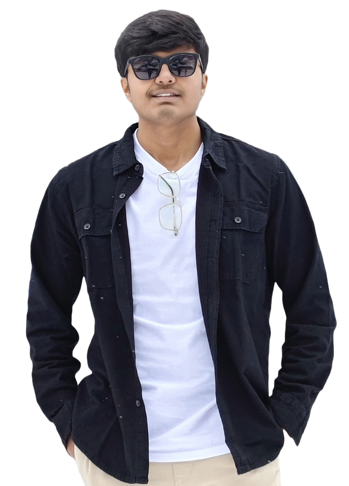

# 🟢 Portfolio_Zeel — Magical Developer Portfolio


> **A visually stunning, interactive portfolio inspired by Doctor Strange's Time Stone.**

---

## ✨ Live Demo

[](https://your-live-demo-link.com)

---

## 🪄 Features

- 🟢 **Time Stone Theme:** Magical, animated contact section inspired by Doctor Strange
- 🧑‍💻 **3D Social Links:** Interactive 3D social wall (React Three Fiber)
- 🖼️ **Modern Hero Section:** Eye-catching intro with custom graphics
- 📨 **Contact Options:** WhatsApp & Email with animated reveal
- 🌙 **Responsive & Dark Mode:** Looks great on all devices
- ⚡ **Blazing Fast:** Powered by Vite & React

---

## 🛠️ Tech Stack


---

## 📸 Screenshots

> _Add your own screenshots below!_



---

## 🚀 Getting Started

```bash
# 1. Clone the repo
 git clone https://github.com/ZeelVC/Portfolio_Zeel.git
 cd Portfolio_Zeel

# 2. Install dependencies
 npm install

# 3. Start the development server
 npm run dev
```

---

## 📄 Resume

[Download Resume](public/assets/Resume_Zeel_Chotaliya.pdf)

---

## 🙋‍♂️ Contact

- **Portfolio:** [zeelvc.github.io/Portfolio_Zeel](https://github.com/ZeelVC/Portfolio_Zeel)
- **Email:** zeelvc7@gmail.com
- **WhatsApp:** [Chat on WhatsApp](https://wa.me/919265727707)
- **LinkedIn:** [Zeel Chotaliya](https://www.linkedin.com/in/zeel-chotaliya-95b940237/)

---

## ⭐ Acknowledgements

- [Doctor Strange & Marvel](https://www.marvel.com/characters/doctor-strange-stephen-strange) for the Time Stone inspiration
- [Vite](https://vitejs.dev/), [React](https://react.dev/), [TailwindCSS](https://tailwindcss.com/), [Three.js](https://threejs.org/)

---

> _Made with 💚 by Zeel Chotaliya_
